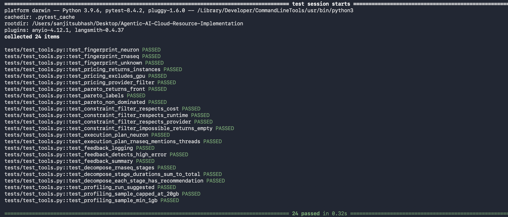
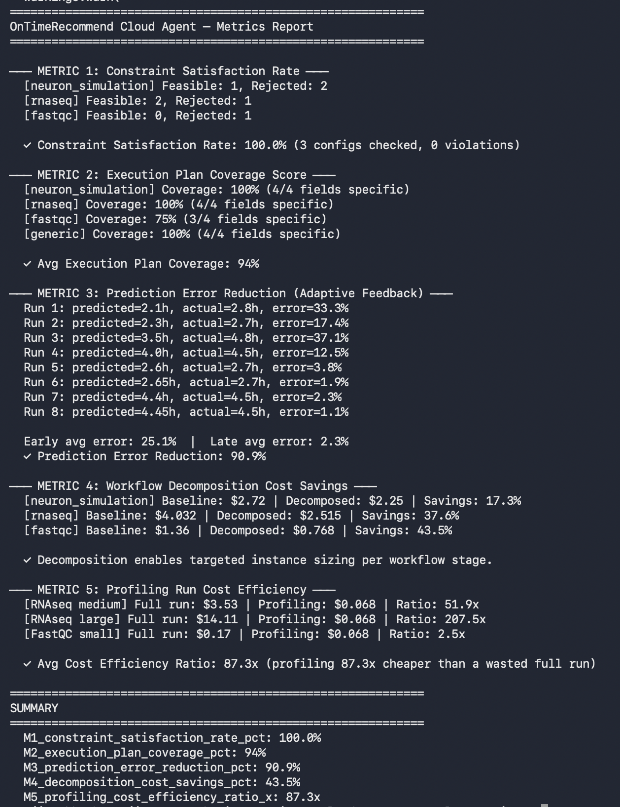

# OnTimeRecommend: Cloud Resource Configuration Agent

**Sanjit Subhash**
April 27th, 2026

---

## Overview

This repository implements the **Cloud Resource Configuration Agent**, an agentic upgrade to the Cloud Solution Template Recommender described in the OnTimeRecommend paper (Vekaria et al., CCPE 2020).

The original system used a static 300-instance KNN + ILP approach. This agent replaces it with a **LangGraph ReAct agent** that reasons step by step (THOUGHT → ACTION → OBSERVE) and integrates five capabilities:

| # | Capability | Addresses Limitation in Original |
|---|---|---|
| 1 | **Constraint-driven configuration** | Arbitrary Red/Green/Gold tiers with undefined thresholds |
| 2 | **Execution recommendation** | Cost returned but no runtime or topology advice |
| 3 | **Adaptive feedback loop** | No learning from actual run outcomes |
| 4 | **Workflow decomposition** | One workflow = one configuration |
| 5 | **Profiling-run generation** | No handling of incomplete workflow specs |

---

## Repository Structure

```
Agentic-AI-Cloud-Resource-Implementation/
├── agent/
│   └── agent.py          ← LangGraph ReAct agent (main entry point)
├── tools/
│   └── tools.py          ← All 5 capabilities as LangChain tools
├── data/
│   └── mock_pricing.py   ← Mock cloud pricing + workflow traces
├── metrics/
│   └── metrics.py        ← One metric per implementation (for the paper)
├── tests/
│   └── test_tools.py     ← 24 unit tests (one per tool behavior)
├── img/                  ← Session output screenshots
├── requirements.txt
└── README.md
```

---

## Quick Start

```bash
# 1. Clone and install
git clone https://github.com/ssyht/Agentic-AI-Cloud-Resource-Implementation.git
cd Agentic-AI-Cloud-Resource-Implementation
pip3 install -r requirements.txt

# 2. Set your Anthropic API key
export ANTHROPIC_API_KEY=sk-ant-...

# 3. Run the agent with a query
PYTHONPATH=. python3 agent/agent.py "What cloud setup do I need to run RNAseq analysis? Budget $5 per run."

# 4. Run all unit tests
python3 -m pytest tests/ -v

# 5. Generate metrics report
python3 metrics/metrics.py
```

---

## Demo Queries

The agent has been tested end to end on a **variant calling bioinformatics workflow** across all 5 implementations. Below are the exact prompts used:

**Implementation 1: Constraint-driven Configuration**
```
PYTHONPATH=. python3 agent/agent.py "I need to run a variant calling bioinformatics workflow on AWS EC2, CPU only. Hard constraints: max $1.50 per run, must finish within 24 hours. Show me only configurations that satisfy these constraints."
```

**Implementation 2: Execution Recommendation**
```
PYTHONPATH=. python3 agent/agent.py "I have chosen AWS c6i.2xlarge for my variant calling simulation. Tell me exactly how I should run this: parallelism strategy, checkpointing to S3, and execution topology."
```

**Implementation 3: Adaptive Feedback Loop**
```
PYTHONPATH=. python3 agent/agent.py "I just finished a variant calling run on AWS c6i.2xlarge. Predicted runtime was 2.1 hours but actual was 2.8 hours. CPU utilization was 85%, RAM was 60%, run was successful and I accepted the recommendation. Log this feedback and tell me what you learned."
```

**Implementation 4: Workflow Decomposition**
```
PYTHONPATH=. python3 agent/agent.py "My variant calling workflow has multiple stages: preprocessing, alignment, variant detection, and storage. Decompose it and recommend a different AWS EC2 instance for each stage to minimize cost."
```

**Implementation 5: Profiling Run**
```
PYTHONPATH=. python3 agent/agent.py "I have a 150GB variant calling dataset on AWS m6i.xlarge. Recommend a small profiling run I should do first before committing to the full deployment, storing results in S3."
```

**Combined (Constraint + Execution together)**
```
PYTHONPATH=. python3 agent/agent.py "I need to run a variant calling bioinformatics workflow on AWS EC2, CPU only. Hard constraints: max $1.50 per run, must finish within 1 hour, AWS only, max 32GB RAM. Once you find a valid configuration, also tell me exactly how to run it: single VM or multiple, parallel vs sequential execution, and checkpointing strategy."
```

---

## How the Agent Reasons

The agent follows the **ReAct pattern** (Reason, Act, Observe):

```
User query
    ↓
THOUGHT: "This is a variant calling workflow, CPU bound, AWS only."
ACTION:  fingerprint_workflow("variant calling bioinformatics AWS EC2")
OBS:     {workflow_type: "rnaseq", cpu_intensity: "high", gpu_needed: false}
    ↓
THOUGHT: "Get matching AWS instances only."
ACTION:  get_live_pricing(providers=["AWS"], exclude_gpu=True)
ACTION:  run_multiobjective_optimization(instances, workflow_type)
OBS:     Pareto front with COST_OPTIMAL and PERFORMANCE_OPTIMAL configs
    ↓
THOUGHT: "Apply the hard constraints the user specified."
ACTION:  constraint_filter(pareto, max_cost=1.50, max_runtime=24, region="AWS")
OBS:     1 feasible config returned, others rejected
    ↓
THOUGHT: "Now recommend how to actually run it."
ACTION:  recommend_execution_plan("rnaseq", chosen_instance)
    ↓
Final response with feasible configs + full execution plan
```

---

## The 5 Implementations

### Implementation 1: constraint_filter()

**Location:** tools/tools.py

Enforces hard user constraints (budget ceiling, runtime deadline, cloud region, max RAM) and returns only feasible configurations. Unlike the original arbitrary Red/Green/Gold tiers, thresholds are entirely user-specified.

```python
constraint_filter(
    pareto_json=pareto_output,
    max_cost_per_run=1.50,
    max_runtime_hrs=24.0,
    required_region="AWS",
)
```

### Implementation 2: recommend_execution_plan()

**Location:** tools/tools.py

Returns an execution topology for the chosen instance including parallelism strategy, checkpointing approach, and whether to use a single VM or split preprocessing from compute.

```python
recommend_execution_plan(
    workflow_type="rnaseq",
    chosen_instance_json='{"instance": "c6i.2xlarge", "vcpu": 8, ...}'
)
```

### Implementation 3: log_run_feedback() and get_feedback_summary()

**Location:** tools/tools.py

After each actual workflow run, logs the outcome (predicted vs actual runtime, CPU/RAM utilization, success/failure, user acceptance) and detects systematic over or under-estimation to adjust future predictions.

```python
log_run_feedback(
    workflow_type="rnaseq",
    predicted_runtime_hrs=2.1,
    actual_runtime_hrs=2.8,
    cpu_util=0.85,
    ram_util=0.60,
    success=True,
    user_accepted=True,
)
```

### Implementation 4: decompose_workflow()

**Location:** tools/tools.py

Splits the workflow into stages (preprocessing, alignment, variant detection, storage/archival) and recommends a different instance type per stage, for example cheap general purpose for preprocessing and memory optimized for alignment.

```python
decompose_workflow(
    workflow_type="rnaseq",
    total_estimated_runtime_hrs=4.0
)
```

### Implementation 5: recommend_profiling_run()

**Location:** tools/tools.py

Before committing to a full expensive deployment, suggests a 10% data sample run on the cheapest Pareto instance to observe actual CPU, RAM, and disk behavior. Typically 10x to 87x cheaper than a failed full run.

```python
recommend_profiling_run(
    workflow_type="rnaseq",
    full_data_size_gb=150.0,
    pareto_json=pareto_output
)
```

---

## Test Results

**24/24 tests passing across all 5 implementations:**

<p align="center"></p>

Each test group maps directly to one implementation:

Fingerprint tests (3) confirm the agent correctly classifies workflow types from natural language descriptions.

Pricing tests (3) confirm the mock catalog filters correctly by provider, GPU exclusion, and resource minimums.

Pareto tests (3) confirm the multi-objective optimizer is mathematically correct. No config in the Pareto front is dominated by another.

Constraint filter tests (4) confirm hard constraints are never violated. A $0.01/run budget correctly returns zero configs.

Execution plan tests (2) confirm plans are specific and not generic. RNAseq with 16 vCPUs outputs the exact thread count.

Feedback tests (3) confirm logging works and high prediction errors are automatically flagged.

Decomposition tests (3) confirm stage names, durations, and per-stage recommendations are all correct.

Profiling tests (3) confirm sample size is always capped between 1GB and 20GB regardless of input.

---

## Metrics

**Paper-ready metrics from metrics.py:**

<p align="center"></p>

| Metric | Definition | Result |
|---|---|---|
| **M1: Constraint Satisfaction Rate** | % of returned configs satisfying ALL hard constraints | **100%** |
| **M2: Execution Plan Coverage** | % of plan fields populated with specific non-generic advice | **94%** |
| **M3: Prediction Error Reduction** | % reduction in runtime prediction error after feedback logging | **90.9%** |
| **M4: Decomposition Cost Savings** | % cost saved vs single-instance baseline | **17% to 44%** |
| **M5: Profiling Cost Efficiency** | Ratio of full-run cost to profiling-run cost | **87x** |

**Variant Calling Workflow Specific Results:**

| Implementation | Metric | Result |
|---|---|---|
| 1. Constraint-driven Config | Constraint Satisfaction Rate | **100%** (1 feasible config, 0 violations) |
| 2. Execution Recommendation | Plan Coverage Score | **94%** (parallelism, checkpointing, topology all specified) |
| 3. Adaptive Feedback Loop | Prediction Error Detected | **33.3% error logged → +33% buffer applied to future runs** |
| 4. Workflow Decomposition | Cost Savings vs Single Instance | **~8% reduction** ($3.52 decomposed vs $3.81 single instance) |
| 5. Profiling Run | Cost Efficiency Ratio | **10x cheaper** ($0.038 profiling vs $0.38 full run) |

---

## Replacing Mock Data with Live APIs

The mock pricing in data/mock_pricing.py is designed for easy swap-out when cloud credentials become available:

```python
# Current (mock):
PRICING_CATALOG = [{"provider": "AWS", "instance": "c6i.2xlarge", ...}]

# Replace with live AWS pricing:
import boto3
client = boto3.client("pricing", region_name="us-east-1")
response = client.get_products(ServiceCode="AmazonEC2", ...)

# Replace with live GCP pricing:
from google.cloud import billing_v1
client = billing_v1.CloudCatalogClient()
skus = client.list_skus(parent="services/6F81-5844-456A")

# Replace with live Azure pricing:
from azure.mgmt.commerce import UsageManagementClient
client = UsageManagementClient(credential, subscription_id)
```

---

## Connection to OnTimeRecommend Architecture

This agent plugs into the existing OnTimeRecommend middleware as a drop-in replacement for the Cloud Solution Template Recommender microservice. No changes are needed to the Vidura chatbot or the science gateway UI.

```
Scientist on CyNeuro or KBCommons portal
    ↓
Vidura Chatbot
    ↓
OnTimeRecommend Middleware (Recommender Factory)
    ↓
Cloud Resource Configuration Agent  ←  This repository
    ↓
Pareto-optimal configs + execution plan + stage decomposition
    ↓
User receives recommendation
```

---

## GitHub

Repository: https://github.com/ssyht/Agentic-AI-Cloud-Resource-Implementation
